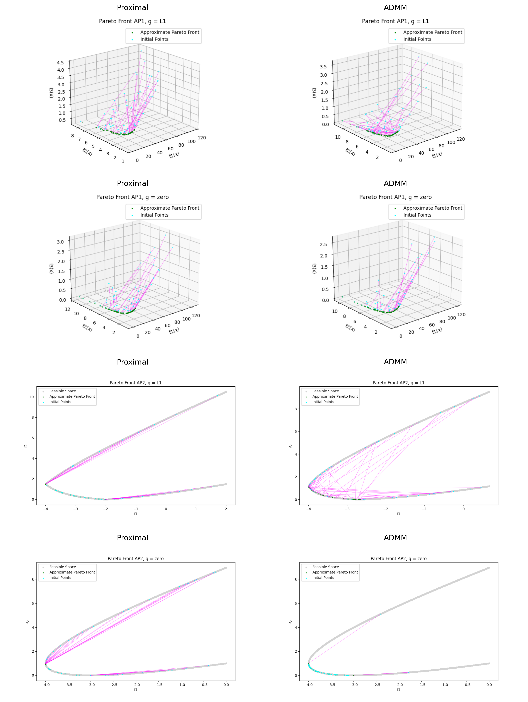
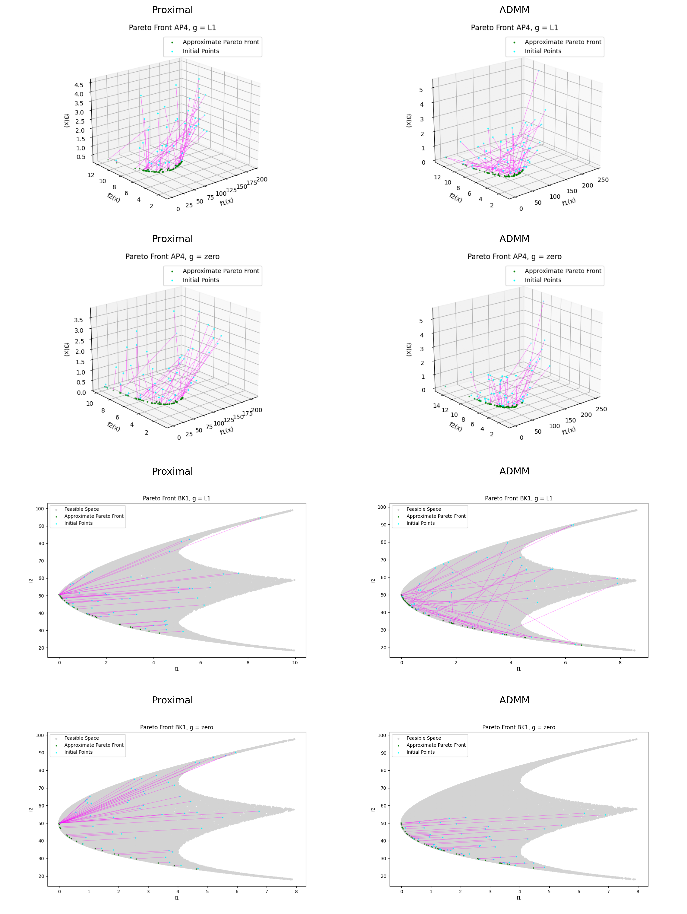
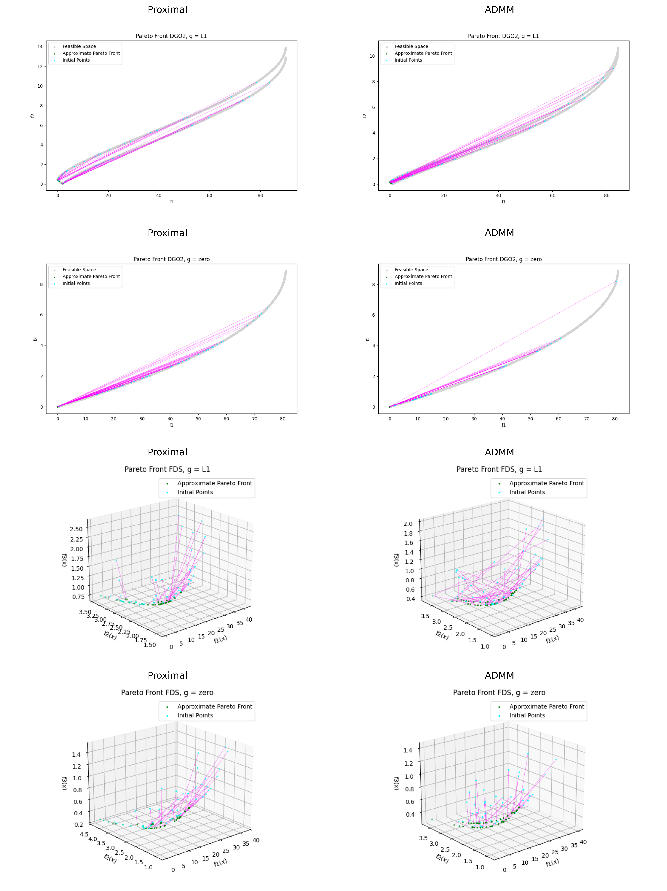
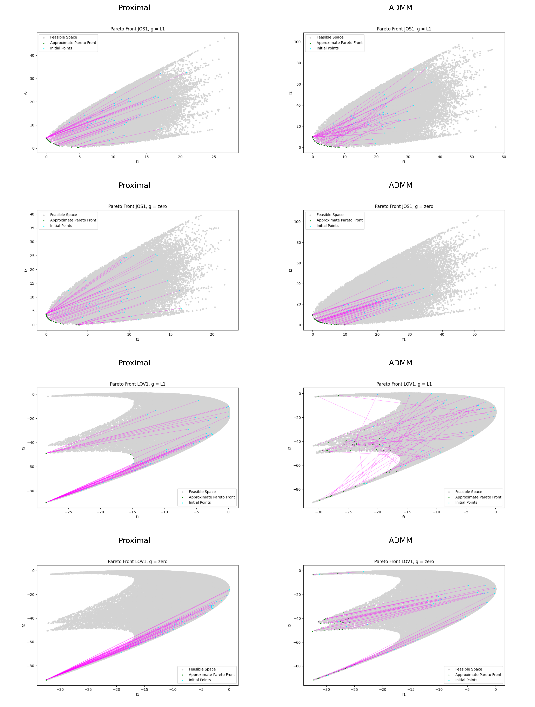
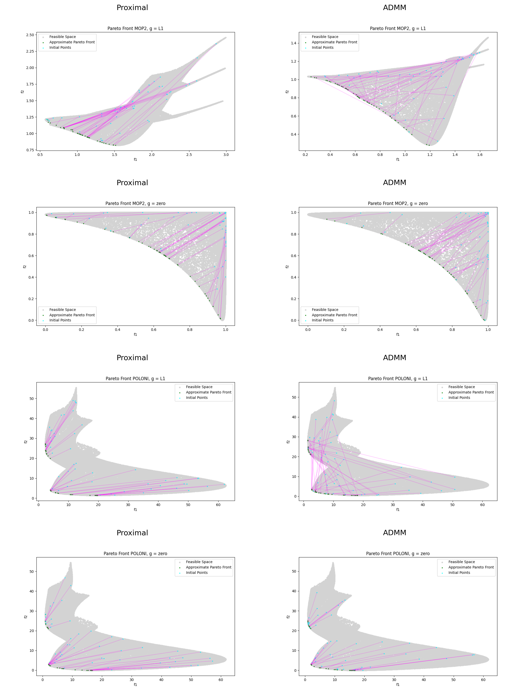
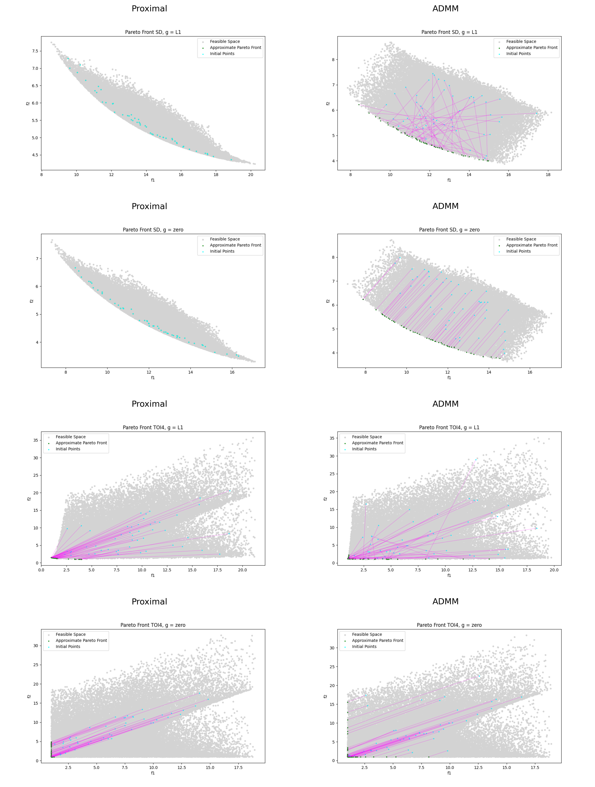
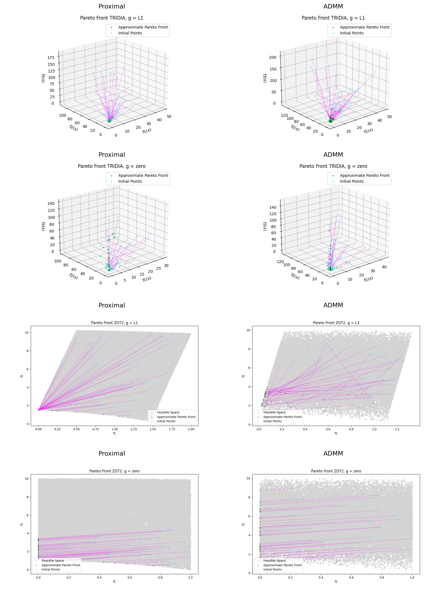
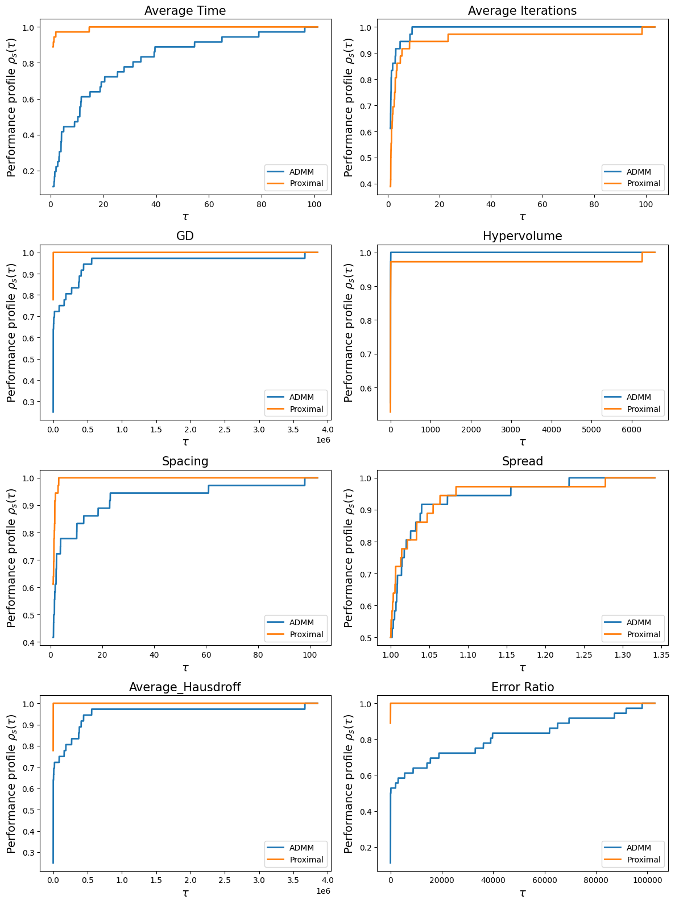
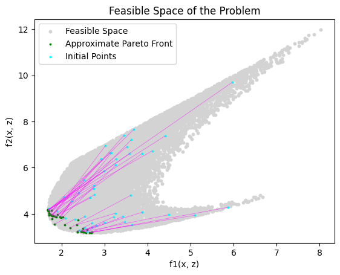

# 1. Optimal Pareto Front Comparisons (Proximal and ADMM)

# 2. Performance Profile Comparisons (Proximal and ADMM)

I am not quoting the metrics Converage, R2, IGD and Epsilon as they get zero for some of the problems and hence comparison is not meaningful.

# 3. ADMM Results

| Problem | g(x) | avg_time | avg_iter | GD | Hypervolume | Spacing | Spread | Average_Hausdroff | Error_Ratio |
|---|---|---|---|---|---|---|---|---|---|
| AP1 | 0 | 5.4548 | 52.945 | 0.1807 | 61.2402 | 0.1952 | 0.989 | 0.1807 | 0.02 |
|  | l1 | 32.9512 | 8.3029 | 1.8428 | 82.9541 | 1.78 | 1.0297 | 1.8428 | 0.1886 |
| AP2 | 0 | 0.7098 | 5.935 | 0.0003 | 0.8207 | 0.0094 | 1.0149 | 0.0003 | 0.695 |
|  | l1 | 5.8501 | 2.5959 | 0.0093 | 1.1752 | 0.008 | 0.9952 | 0.0093 | 0.3973 |
| AP4 | 0 | 11.1379 | 62.14 | 4.4237 | 339.7329 | 3.3648 | 1.0146 | 4.4237 | 0.03 |
|  | l1 | 58.8634 | 16.125 | 4.0807 | 286.4768 | 2.5217 | 0.9972 | 4.0807 | 0.0882 |
| BK1 | 0 | 1.305 | 8.22 | 0.0011 | 105.4222 | 0.2097 | 1.007 | 0.0011 | 0.33 |
|  | l1 | 17.6961 | 4.8794 | 0.0492 | 185.2213 | 0.2194 | 1.0023 | 0.0492 | 0.3617 |
| DGO2 | 0 | 0.8653 | 7.845 | 0.0 | 0.0 | 0.0 | 1.0103 | 0.0 | 0.98 |
|  | l1 | 14.4272 | 5.3571 | 0.869 | 0.0608 | 0.8236 | 1.2401 | 0.869 | 0.619 |
| FDS | 0 | 1.7768 | 18.19 | 1.5961 | 12.6091 | 1.5889 | 1.0504 | 1.5961 | 0.055 |
|  | l1 | 30.0002 | 7.9886 | 0.0833 | 11.5094 | 0.0917 | 0.9848 | 0.0833 | 0.142 |
| JOS1 | 0 | 0.5422 | 9.28 | 0.0008 | 82.7005 | 0.0692 | 1.0073 | 0.0008 | 0.39 |
|  | l1 | 16.2095 | 6.9828 | 5.6059 | 85.3028 | 4.3661 | 1.162 | 5.6059 | 0.1552 |
| LOV1 | 0 | 5.0589 | 10.44 | 24.9663 | 0.0 | 0.4723 | 0.9714 | 24.9663 | 0.99 |
|  | l1 | 20.2405 | 3.0357 | 25.5732 | 0.0 | 0.9412 | 0.9347 | 25.5732 | 0.9881 |
| MOP2 | 0 | 1.7716 | 13.54 | 0.1176 | 0.2981 | 0.0115 | 1.0044 | 0.1176 | 0.095 |
|  | l1 | 17.9501 | 5.9563 | 0.2388 | 0.3029 | 0.0107 | 0.9924 | 0.2388 | 0.3279 |
| POLONI | 0 | 3.4793 | 11.83 | 4.5905 | 358.0754 | 0.4783 | 1.0198 | 4.5905 | 0.725 |
|  | l1 | 38.6743 | 9.8607 | 6.9201 | 412.6241 | 1.5742 | 1.0189 | 6.9201 | 0.6967 |
| SD | 0 | 3.3336 | 10.425 | 0.0996 | 10.3082 | 0.0416 | 0.9636 | 0.0996 | 0.615 |
|  | l1 | 51.8519 | 9.3846 | 0.1321 | 8.644 | 0.0738 | 0.9666 | 0.1321 | 0.5385 |
| TOI4 | 0 | 0.7289 | 8.72 | 3.9327 | 0.6884 | 0.1408 | 1.0033 | 3.9327 | 0.955 |
|  | l1 | 47.6184 | 10.5321 | 3.8029 | 0.3303 | 0.4399 | 0.9722 | 3.8029 | 0.9174 |
| TRIDIA | 0 | 1.9624 | 8.02 | 21.0572 | 34590.35 | 4.1272 | 0.9726 | 21.0572 | 0.775 |
|  | l1 | 29.8219 | 13.8073 | 36.6798 | 9822.7196 | 4.7928 | 0.972 | 36.6798 | 0.8716 |
| ZDT2 | 0 | 2.6944 | 9.49 | 0.6711 | 0.2204 | 0.0749 | 1.002 | 0.6711 | 0.96 |
|  | l1 | 21.147 | 3.0609 | 3.7147 | 0.2661 | 0.1007 | 0.9687 | 3.7147 | 0.9797 |

# 4. Iterations on Constrained JOS1 Problem

The problem I've tried to solve is a constrained version of the JOS1 problem, which is defined as follows:

$$ 
\begin{aligned}
\min_{x, z} \quad & F(x) + G(z) \\
\text{s.t.} \quad & Ax + Bz = c
\end{aligned}
$$

where

$$
F(x) = 
\begin{bmatrix}
f_1(x) \\
f_2(x)
\end{bmatrix}, \quad 
G(z) = 
\begin{bmatrix}
g_1(z) \\
g_2(z)
\end{bmatrix}
$$

$$
f_1(x) = \frac{1}{2} \|x\|^2, \quad
f_2(x) = \frac{1}{2} \|x - 2\|^2, \quad
g_1(z) = \frac{1}{2} \|z\|^2, \quad
g_2(z) = \frac{1}{2} \|z - 2\|^2
$$

$$
A =
\begin{bmatrix}
1 & 0 \\
0 & 1
\end{bmatrix}, \quad
B =
\begin{bmatrix}
1 & 0 & 1 \\
0 & 1 & 1
\end{bmatrix}, \quad
c =
\begin{bmatrix}
2 \\
3
\end{bmatrix}
$$

The iterates on different initializations are:

### Point 1

| x | z | dx | dz | t | F1 | F2 |
|---|---|---|---|---|---|---|
| [0.545151, 1.625365] | [1.029926, 0.949713, 0.424922] | [1.0, -1.0] | [-1.0, 1.0, 0.0] | 0.25 | 2.541131 | 3.390976 |
| [0.795151, 1.375365] | [0.779926, 1.199713, 0.424922] | [1.0, -1.0] | [-1.0, 1.0, -0.0] | 0.03125 | 2.376024 | 3.225869 |
| [0.826401, 1.344115] | [0.748676, 1.230963, 0.424922] | [0.901867, -0.901867] | [-0.901866, 0.901868, -1e-06] | 0.007812 | 2.372964 | 3.222809 |
| [0.833447, 1.337069] | [0.741631, 1.238009, 0.424922] | [0.195124, -0.195124] | [-0.195124, 0.195124, -0.0] | 0.007812 | 2.372814 | 3.222659 |
| [0.834971, 1.335544] | [0.740106, 1.239533, 0.424922] | [0.00229, -0.00229] | [-0.002291, 0.002289, 1e-06] | 0.0625 | 2.372807 | 3.222652 |
| [0.835115, 1.335401] | [0.739963, 1.239676, 0.424922] | [0.001145, -0.001145] | [-0.001146, 0.001144, 1e-06] | 0.03125 | 2.372807 | 3.222652 |
| [0.83515, 1.335365] | [0.739927, 1.239712, 0.424922] | [0.0, 0.0] | [0.0, 0.0, 0.0] | 1.0 | 2.372807 | 3.222652 |

### Point 2

| x | z | dx | dz | t | F1 | F2 |
|---|---|---|---|---|---|---|
| [0.166913, 1.80394] | [1.60388, 0.966853, 0.229207] | [1.0, -1.0] | [-1.0, 1.0, 0.0] | 0.5 | 3.420916 | 3.87933 |
| [0.666913, 1.30394] | [1.10388, 1.466853, 0.229207] | [0.0, -0.0] | [-1.0, -1.0, 1.0] | 0.0625 | 2.783889 | 3.242303 |
| [0.666913, 1.30394] | [1.04138, 1.404353, 0.291707] | [1.0, -1.0] | [-1.0, 1.0, -0.0] | 0.0625 | 2.643403 | 3.226817 |
| [0.729413, 1.24144] | [0.97888, 1.466853, 0.291707] | [0.0, 0.0] | [-1.0, -1.0, 1.0] | 0.03125 | 2.634087 | 3.217501 |
| [0.729413, 1.24144] | [0.94763, 1.435603, 0.322957] | [-0.0, -0.0] | [-1.0, -1.0, 1.0] | 0.015625 | 2.568238 | 3.214152 |
| [0.729413, 1.24144] | [0.932005, 1.419978, 0.338582] | [0.273256, -0.273256] | [-1.000001, -0.453489, 0.726745] | 0.007812 | 2.536413 | 3.213577 |
| [0.731548, 1.239305] | [0.924193, 1.416435, 0.34426] | [0.391298, -0.391313] | [-0.391343, 0.391268, 4.5e-05] | 0.007812 | 2.524987 | 3.213507 |
| [0.734605, 1.236248] | [0.921135, 1.419492, 0.34426] | [0.0942, -0.094186] | [-0.094156, 0.09423, -4.5e-05] | 0.003906 | 2.524958 | 3.213478 |
| [0.734973, 1.23588] | [0.920768, 1.41986, 0.34426] | [0.039664, -0.039669] | [-0.03968, 0.039653, 1.6e-05] | 0.007812 | 2.524957 | 3.213477 |
| [0.735282, 1.23557] | [0.920458, 1.42017, 0.34426] | [0.0, 0.0] | [0.0, 0.0, 0.0] | 1.0 | 2.524957 | 3.213477 |

### Point 3

| x | z | dx | dz | t | F1 | F2 |
|---|---|---|---|---|---|---|
| [0.160867, 1.621604] | [-0.130762, -0.5915, 1.969895] | [0.0, 0.0] | [1.0, 1.0, -1.0] | 0.5 | 3.451469 | 7.39126 |
| [0.160867, 1.621604] | [0.369238, -0.0915, 1.469895] | [1.0, -1.0] | [-1.0, 1.0, -0.0] | 0.25 | 2.48039 | 5.420181 |
| [0.410867, 1.371604] | [0.119238, 0.1585, 1.469895] | [-0.0, -0.0] | [1.0, 1.0, -1.0] | 0.25 | 2.125021 | 5.064812 |
| [0.410867, 1.371604] | [0.369238, 0.4085, 1.219895] | [1.0, -1.0] | [-1.0, 1.0, -0.0] | 0.125 | 1.920732 | 4.360523 |
| [0.535867, 1.246604] | [0.244238, 0.5335, 1.219895] | [0.0, 0.0] | [1.0, 1.0, -1.0] | 0.125 | 1.836798 | 4.276589 |
| [0.535867, 1.246604] | [0.369238, 0.6585, 1.094895] | [1.0, -1.0] | [-1.0, 1.0, -0.0] | 0.0625 | 1.804965 | 3.994756 |
| [0.598367, 1.184104] | [0.306738, 0.721, 1.094895] | [1.0, -1.0] | [-1.0, 1.0, 0.0] | 0.03125 | 1.786436 | 3.976227 |
| [0.629617, 1.152854] | [0.275488, 0.75225, 1.094895] | [0.0, 0.0] | [1.0, 1.0, -1.0] | 0.015625 | 1.78303 | 3.972821 |
| [0.629617, 1.152854] | [0.291113, 0.767875, 1.07927] | [0.665651, -0.665649] | [-0.331302, 0.999997, -0.334348] | 0.015625 | 1.782347 | 3.940888 |
| [0.640017, 1.142454] | [0.285936, 0.7835, 1.074046] | [0.001527, -0.001526] | [0.996947, 1.0, -0.998474] | 0.000977 | 1.782015 | 3.930108 |
| [0.640019, 1.142452] | [0.28691, 0.784477, 1.073071] | [0.084559, -0.084559] | [0.830883, 1.0, -0.915441] | 0.000488 | 1.782012 | 3.928154 |
| [0.64006, 1.142411] | [0.287316, 0.784965, 1.072624] | [0.119991, -0.119991] | [-0.107578, 0.132404, -0.012413] | 0.007812 | 1.782011 | 3.92726 |
| [0.640998, 1.141474] | [0.286475, 0.785999, 1.072527] | [0.001902, -0.001902] | [-0.001884, 0.001919, -1.8e-05] | 0.0625 | 1.782009 | 3.927063 |
| [0.641116, 1.141355] | [0.286357, 0.786119, 1.072526] | [0.0, 0.0] | [0.0, 0.0, 0.0] | 1.0 | 1.782009 | 3.927061 |

### Point 4

This point does not converge as we can see in the pareto front also.

| x | z | dx | dz | t | F1 | F2 |
|---|---|---|---|---|---|---|
| [-0.101985, 0.793916] | [0.764882, 0.868982, 1.337103] | [1.0, -1.0] | [-1.0, 1.0, -0.0] | 0.125 | 1.88436 | 4.558566 |
| [0.023015, 0.668916] | [0.639882, 0.993982, 1.337103] | [1.0, -0.0] | [-0.0, 1.0, -1.0] | 0.0625 | 1.816635 | 4.490841 |
| [0.085515, 0.668916] | [0.639882, 1.056482, 1.274603] | [1.0, -1.0] | [-1.0, 1.0, 0.0] | 0.03125 | 1.802488 | 4.351693 |
| [0.116765, 0.637666] | [0.608632, 1.087732, 1.274603] | [1.0, -0.0] | [-0.0, 1.0, -1.0] | 0.015625 | 1.799228 | 4.348434 |
| [0.13239, 0.637666] | [0.608632, 1.103357, 1.258978] | [0.772456, 0.22753] | [0.22754, 0.772465, -0.999995] | 0.007812 | 1.798499 | 4.316455 |
| [0.138425, 0.639443] | [0.61041, 1.109391, 1.251165] | [0.558231, 0.441769] | [0.441769, 0.558231, -1.0] | 0.000977 | 1.798407 | 4.300737 |
| [0.13897, 0.639875] | [0.610841, 1.109937, 1.250189] | [0.472458, 0.361759] | [0.36177, 0.472469, -0.834228] | 0.000244 | 1.798405 | 4.298783 |
| [0.139086, 0.639963] | [0.610929, 1.110052, 1.249985] | [0.453099, 0.342279] | [0.342291, 0.453111, -0.79539] | 3.1e-05 | 1.798405 | 4.298375 |
| [0.139099, 0.639973] | [0.61094, 1.110066, 1.249961] | [0.450491, 0.34003] | [0.340042, 0.450504, -0.790534] | 1.5e-05 | 1.798405 | 4.298327 |
| [0.139106, 0.639979] | [0.610945, 1.110073, 1.249949] | [0.450421, 0.338637] | [0.33865, 0.450434, -0.789071] | 8e-06 | 1.798405 | 4.298303 |
| [0.13911, 0.639981] | [0.610947, 1.110076, 1.249943] | [0.449773, 0.33808] | [0.338093, 0.449786, -0.787866] | 0.0 | 1.798405 | 4.298291 |

